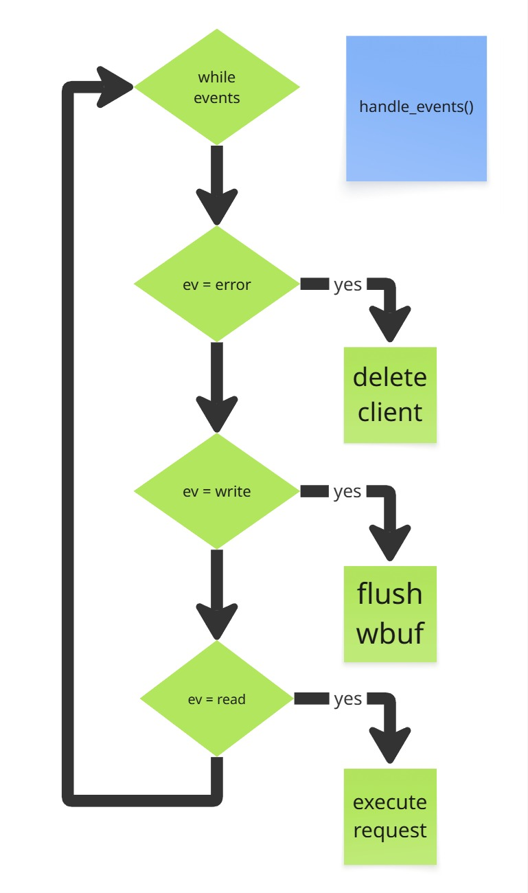
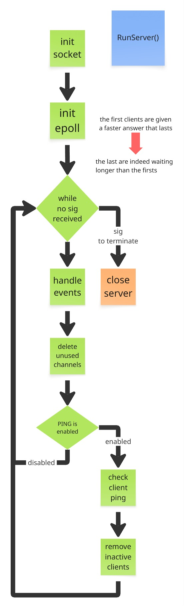

# FT_IRC #

## <a name="introduction-en">📖 Introduction ##

Make your own IRC Server that no one asked for.

*This project has been created as part of the 42 curriculum by oelleaum, ppontet.*

*It has been later modified to add features and fix some bugs so it's NOT the same version from evaluation.*

## 📋 Table of Contents ##

* [📖 Introduction](#introduction-en)
* [⚙️ Requirements](#requirements-en)
* [🔧 Architecture / Design Patterns](#arch-en)
* [📝 Features](#features-en)
* [🧪 Tester](#tester-en)
* [🤖 Async bots](#async-bots-en)
* [🚀 How to use](#use-en)
* [How to stop](#stop-en)

## <a name="requirements-en">⚙️ Requirements ##

The project uses `c++` compiler, with `-std=c++98` as a requirement.

Our `c++` is exactly this version :

```sh
$> c++ --version
Ubuntu clang version 12.0.1-19ubuntu3
Target: x86_64-pc-linux-gnu
Thread model: posix
```

If you want to run the tester, you will need at least a recent version of `cargo` (Rust).

Use only the following `C functions` :

* select, poll, **epoll (epoll_create, epoll_ctl,epoll_wait)**, kqueue (kqueue, kevent)
* **getaddrinfo**, **gethostbyname**, **freeaddrinfo**, **gai_strerror**
* **socket**, **accept**, **listen**, **send**, **recv**, **bind**, connect, setsockopt, getsockname, getprotobyname
* htons, htonl, **ntohs**, ntohl
* inet_addr, inet_ntoa, **inet_ntop**
* lseek, **close**
* **signal**, **sigaction**, **sigemptyset**, sigfillset, sigaddset, sigdelset, sigismember

### How does it work ###

This is the first big project after the `C` projects at 42 so we tried to make it the most Object-Oriented possible as we can now use `C++`.

### References ###

We used as a reference the [RFC 2812](https://datatracker.ietf.org/doc/html/rfc2812) , and some precisions of [RFC 2811](https://datatracker.ietf.org/doc/html/rfc2811). We implemented only the server, we were not required to implement a client neither a server-to-server communication. The project should be compliant with the `RFC 2812`, at least for the implemented commands.

We used this website to start porting to BSD ([kqueue vs epoll](https://pcnews.ru/blogs/kernel_queue_the_complete_guide_on_the_most_essential_technology_for_high_performance_io-1143360.html)). As `epoll` doesn't exist on BSD, we use `kqueue` instead.


## <a name="arch-en">🔧 Architecture / Design Patterns ##

### Pattern Factory ###

* The `CommandFactory::findAndCreateCommand()` function select the right command and build it for the client that request it.

#### Benefits ####

* **Extensibility**: easy addition of new commands
* **Maintainability**: centralized creation logic
* **Readability**: explicit construction of complex objects

### Graph ###



### Classes ###

We used 5 classes :

* `Server` : handles the server operations, manage everything
* `Client` : stores informations of a client/user
* `Channel` : stores informations of a channel
* `ACommand` : an abstract class to show the minimum to implement to create new commands
* `Debug` : Debug printing to make correctly formatted logging

A Client doesn't have any permission to execute anything, the server does it for him. A Channel has it's own permissions to work on his own member variables. A Command is a regroupment of server, client and channel operations. The server acts as the orchestrator of its group of users and channels.

## <a name="features-en">📝 Features ##

### Commands notation ###

* Each `<param>` is a string, delimited by a single space (` `).
* Parenthesis such as `(` and `)` are used to show which block can be repeated.
* `*` represent that 0 or more params could be used.
* Square brackets such as `[` and `]` are used to delimit a block that is optionnal.
* Comma (`,`) is used to separate each param inside a same 'block'.
* A param starting with `:` will contain all the next characters in a same param, permit to send a string containing spaces.

### Authentification ###

* PASS `<password>`
* NICK `<nickname>`
* USER `<username>` `<mode>` `<hostname>` `<realname>` : mode and hostname are unused

### Basics ###

* JOIN `#<channel>*(,#<channel>)` `<key1>*(,<key2>)`
* INVITE `<nickname>` `<channel>`
* TOPIC `<channel>` `[ <topic> ]`
* KICK `#<channel>*(,#<channel>)` `#<user>*(,#<user>)` `<comment>`
* MODE (channel only) : `#<channel>` `*(<modes>` `<modeParam>)`
* PRIVMSG `<msgtarget>` `<text to be sent>`
* PART `#<channel>*(,#<channel>)` `<part message>`
* QUIT `<quit message>`

### Bonus ###

* TIME
* PONG

## <a name="tester-en"> 🧪 Tester ##

We realized a tester in rust using tokio to experiment and discover async in client server communication
Using rust guarantees memory safety at compile time without loosing performances.

The crate Tokio gave us a layer to program asychronously.

* Using `make test` will, by default, run all unit tests connection and advanced tests, without server log monitoring and with a maximum of 1000 clients / wave
* Using `make test LOG=1` activated server logs monitoring, if terminator is installed
* Using `make test CLIENTS=500` run tests with a maximum of 500 clients per wave
* Using `make test STRESS=1` skip the unit tests and runs only connection and advanced tests
* Using `make test BEH=1` will test each unit tests (behaviors)

## <a name="async-bots-en"> 🤖 Async bots ##

To demonstrate the advantage of tokio and rust async, we synthetized what we learned into a simple 3 bots program. 
It allows several users to interact with each bot, without blocking each other.
To illustrate how bots operate with user and with each other, we included a basic riddles games for demonstration purpose.

Use make bonus to run the server, the bots and expect a terminal already authenticated to open and start to play.

## <a name="use-en">🚀 How to use ##

```sh
./ircserv port password
```

* `port` port number where server will listen and answer incoming IRC connections
* `password` password of the connection, the clients will need it to connect

## <a name="stop-en"> How to stop ##

The server have some signal handling, currently to stop it, you need to send a `SIGINT` or a `SIGTERM` to end it properly. If it receives a `SIGPIPE` (error from a write/read) or a `SIGQUIT`, it's simply ignored.

---
